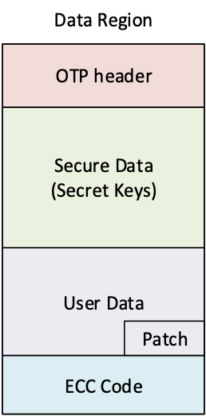

# AST2600 Secure Boot

AST2600 support root of trust (RoT) measurement. The following chapter will 
introduce the secure image generation tool `socsec` and otp image generation 
tool `otptool`.

## SOCSEC

This tool is used to generate ast2600 secure boot image.

### Usage

#### Setting Up

```bash
sudo apt-get install python3 python3-pip python3-virtualenv
virtualenv .venv
source .venv/bin/activate
pip3 install -r requirements.txt
python3 setup.py install
```

#### Key Generation

* RSA private key

```bash
openssl genrsa -out rsa_key.pem 4096
```

* RSA public key

```bash
openssl rsa -in rsa_key.pem -pubout -out rsa_key-public.pem
```

* ECDSA private key

```bash
openssl ecparam -name secp384r1 -genkey -out ecdsa_key.pem
```

* ECDSA public key

```bash
openssl ec -in ecdsa_key.pem -pubout -out ecdsa_key-public.pem
```

* AES key

```bash
openssl rand 32 > aes_key.bin
```

#### How to use

* RoT image generating command

```bash
usage: socsec make_secure_bl1_image [-h] [--soc SOC] [--bl1_image BL1_IMAGE]
                                    [--stack_intersects_verification_region {true,false}]
                                    [--header_offset HEADER_OFFSET]
                                    [--rsa_sign_key RSA_SIGN_KEY]
                                    [--ecdsa_sign_key ECDSA_SIGN_KEY]
                                    [--rsa_key_order ORDER]
                                    [--gcm_aes_key GCM_AES_KEY]
                                    [--output OUTPUT] [--algorithm ALGORITHM]
                                    [--rsa_padding PADDING]
                                    [--revision_id REVISION_ID]
                                    [--signing_helper [APP]]
                                    [--signing_helper_with_files [APP]]
                                    [--enc_offset ENC_OFFSET]
                                    [--aes_key [AES_KEY]] [--key_in_otp]
                                    [--rsa_aes [RSA_AES]]
                                    [--flash_patch_offset FLASH_PATCH_OFFSET]
                                    [--cot_algorithm [ALGORITHM]]
                                    [--cot_verify_key [COT_VERIFY_KEY] |
                                    --cot_digest COT_DIGEST]

optional arguments:
  -h, --help            show this help message and exit
  --soc SOC             soc id (e.g. 2600, 1030)
  --bl1_image BL1_IMAGE
                        Bootloader 1 Image (e.g. u-boot-spl.bin), which will
                        be verified by soc
  --stack_intersects_verification_region {true,false}
                        By default, the maximum size of SPL images socsec will
                        sign is 60KB, since, historically, the SoCs have been
                        using the top of the SRAM for the SPL execution stack.
                        However, on 2600 (A1) and above SoCs, an additional
                        24KB SRAM can be used for the stack, allowing the
                        verification region to occupy the entire 64KB
                        (including signature). For these models of boards,
                        this layout will also be the default in future SDK
                        releases. Use this parameter to explicitly indicate
                        that the SPL image being signed has (=true) or has not
                        (=false) the SPL stack overlapping the 64KB
                        verification region. With this argument set to
                        'false', socsec will sign SPL images up towards 64KB
                        (including 512B signature)
  --header_offset HEADER_OFFSET
                        RoT header offset
  --rsa_sign_key RSA_SIGN_KEY
                        Path to RSA private key file, which will use to sign
                        BL1_IMAGE
  --ecdsa_sign_key ECDSA_SIGN_KEY
                        Path to ECDSA private key file, which will use to sign
                        BL1_IMAGE
  --rsa_key_order ORDER
                        This value the OTP setting(e.g. little, big), default
                        value is "little". If RSA padding mode is PSS,
                        rsa_key_order will be big endian
  --gcm_aes_key GCM_AES_KEY
                        Path to aes private key file, which will use to sign
                        BL1_IMAGE
  --output OUTPUT       Output file name
  --algorithm ALGORITHM
                        Algorithm to use (default: NONE e.g. AES_GCM,
                        AES_RSA2048_SHA256, RSA2048_SHA256, ...), RSA algo
                        support RSA1024, RSA2048, RSA3072 and RSA4096, HASH
                        algo support SHA224, SHA256, SHA384 and SHA512
  --rsa_padding PADDING
                        Algorithm to use (default: pkcs1 e.g. pkcs1, pss), RSA
                        support pkcs1 padding or pss padding
  --revision_id REVISION_ID
                        Revision id for rollback prevention (0 <= REVISION_ID
                        <= 64)
  --signing_helper [APP]
                        Path to helper used for signing
  --signing_helper_with_files [APP]
                        Path to helper used for signing using files
  --flash_patch_offset FLASH_PATCH_OFFSET
                        Flash patch offset for ast2605

enc_group:
  Enable aes encryption in mode 2

  --enc_offset ENC_OFFSET
                        Offset where encryption start
  --aes_key [AES_KEY]   Path to aes key file
  --key_in_otp          aes key is storing in otp
  --rsa_aes [RSA_AES]   Path to RSA public key file, which is used to encrypt
                        aes key

cot_group:
  (deprecated)Chain of trust argument

  --cot_algorithm [ALGORITHM]
                        Algorithm to use (default: NONE e.g. RSA2048_SHA256),
                        RSA algo support RSA1024, RSA2048, RSA3072 and
                        RSA4096, HASH algo support SHA224, SHA256, SHA384 and
                        SHA512
  --cot_verify_key [COT_VERIFY_KEY]
                        Path to RSA public key file, which will use to verify
                        next chain image (BL2)
  --cot_digest COT_DIGEST
                        Path to digest result of next chain image
```

* (DEPRECATED) CoT image generating command

```bash
usage: socsec make_sv_chain_image [-h] [--algorithm ALGORITHM]
                                  [--rsa_key_order ORDER]
                                  [--cot_part BL2_IMAGE:BL2_OUT:BL2_SIGN_KEY:BL2_VERIFY_KEY BL3_IMAGE:BL3_OUT:BL3_SIGN_KEY:BL3_VERIFY_KEY [BL2_IMAGE:BL2_OUT:BL2_SIGN_KEY:BL2_VERIFY_KEY BL3_IMAGE:BL3_OUT:BL3_SIGN_KEY:BL3_VERIFY_KEY ...]]
                                  [--image_relative_path IMAGE_RELATIVE_PATH]
                                  [--signing_helper [APP]]
                                  [--signing_helper_with_files [APP]]

optional arguments:
  -h, --help            show this help message and exit
  --algorithm ALGORITHM
                        Algorithm to use (default: NONE e.g. RSA2048_SHA256,
                        RSA3072_SHA384, ...), RSA algo support RSA1024,
                        RSA2048, RSA3072 and RSA4096, HASH algo support
                        SHA224, SHA256, SHA384 and SHA512
  --rsa_key_order ORDER
                        This value the OTP setting(e.g. little, big), default
                        value is "little"
  --cot_part BL2_IMAGE:BL2_OUT:BL2_SIGN_KEY:BL2_VERIFY_KEY BL3_IMAGE:BL3_OUT:BL3_SIGN_KEY:BL3_VERIFY_KEY [BL2_IMAGE:BL2_OUT:BL2_SIGN_KEY:BL2_VERIFY_KEY BL3_IMAGE:BL3_OUT:BL3_SIGN_KEY:BL3_VERIFY_KEY ...]
  --image_relative_path IMAGE_RELATIVE_PATH
                        Image relative path
  --signing_helper [APP]
                        Path to helper used for signing
  --signing_helper_with_files [APP]
                        Path to helper used for signing using files
```

* Verify command
The verify tool can check the validity of the combination of OTP image and RoT secure image.
```bash
usage: socsec verify [-h] --sec_image IMAGE [--output IMAGE] --otp_image IMAGE
                     [--cot_offset IMAGE]

optional arguments:
  -h, --help          show this help message and exit
  --sec_image IMAGE   Path to secure image
  --output IMAGE      Output non-secure image
  --otp_image IMAGE   Path to otp image
  --cot_offset IMAGE  Offset for every image, e.g. 0x10000:0x100000
```

Here is an example.
There are two stages to make the whole secure image, make RoT image and make CoT image.

* RoT secure image with mode 2 RSA4096_SHA512

```bash
socsec make_secure_bl1_image \
    --algorithm RSA4096_SHA512 \
    --bl1_image path/to/u-boot-spl.bin \
    --output path/to/s_u-boot-spl.bin \
    --rsa_sign_key path/to/test_oem_dss_private_key_4096_1.pem \
    --cot_algorithm RSA4096_SHA512 \
    --cot_verify_key path/to/test_bl2_public_4096.pem \
```

* (DEPRECATED) CoT secure image

```bash
socsec make_sv_chain_image \
--algorithm RSA4096_SHA512 \
--image_relative_path path/to/all_image/ \
--cot_part u-boot.bin:s_u-boot.bin:test_bl2_private_4096.pem:test_bl2_public_4096.pem \
ast2600-ramfs.itb:s_ast2600-ramfs.itb: test_bl3_private_4096.pem: test_bl3_public_4096.pem \
```

The format of `--cot_part` option is `image_input:secure_image_output:sign_key:verification_key`

The `--signing_helper` option can be used to specify any external program for signing hashes. The data to sign (including padding e.g. PKCS1-v1.5) is fed via `STDIN` and the signed data is returned via STDOUT. Arguments for a signing helper is `--rsa_sign_key` in `make_secure_bl1_image` or `sign_key` in `make_sv_chain_image --cot_part`. If the signing helper exits with a non-zero exit code, it means failure.
Here's an example invocation:

```bash
/path/to/my_signing_program /path/to/privatekey.pem
```

`--signing_helper_with_files` is similar to `--signing_helper` except that a temporary file is used to communicate with the helper instead of STDIN and STDOUT. This is useful in situations where the signing helper is using code which is outputting diagnostics on STDOUT instead of STDERR. Here's an example invocation

```bash
/path/to/my_signing_program_with_files \
/path/to/privatekey.pem /tmp/path/to/communication_file
```

Here is an example of `socsec verify`.
```bash
socsec verify --soc 2600 --sec_image /path/to/s_u-boot-spl.bin --otp_image /path/to/otp-all.image
```

`--sec_image` is the RoT secure image which is generated by `make_secure_bl1_image`.

`--otp_image` is the OTP image which is generated by the `otptool`, the `otptool` will
introduce in next chapter.

`--output` is an option which can output the unsigned an unencrypted image.

## OTP Tool

AST2600 built-in 64Kbit one time programmable (OTP) memory for configuration, strap, key storage, patch and user data. Each memory bit cell inside the OTP memory is capable to be programmed once. Typically, the data stored the OTP memory are non-volatile and can preserve permanently, but to improve the FIT (failure in time) of the OTP memory, ECC is recommended to enable.

### Make OTP image

Using this tool to generate the otp image, and using OTP Utility to program that image into OTP memory.

```bash
usage: otptool make_otp_image [-h] [--key_folder KEY_FOLDER]
                              [--user_data_folder USER_DATA_FOLDER]
                              [--output_folder OUTPUT_FOLDER]
                              [--no_last_bit]
                              config

positional arguments:
  config                configuration file

optional arguments:
  -h, --help            show this help message and exit
  --key_folder KEY_FOLDER
                        key folder
  --user_data_folder USER_DATA_FOLDER
                        user data folder
  --output_folder OUTPUT_FOLDER
                        output folder
  --no_last_bit         (develop)remove last bit in OTP header
```
#### Argument

* `config`: the config file is a json format document, which content otp data region, otp config region and otp strap description. Below is an example.

* `key_folder`: put all key file into key folder

* `output_folder`: the generated otp image will put into this folder.

#### Output

* `otp-all.image`: a programmable image, use u-boot otp utility to program this image, which contain all region of otp.

* `*.image`: a programmable image, use u-boot otp utility to program this image
configs/ast2600/security/otp/sample.json is an example for all otp config and otp strap.

* `otp-data.bin`: raw data of otp data region.

`data_region` object is to describe the otp data region, which contain key, user data, otp patch, and ecc code. The figure below is data region layout. When `ecc_region` enable, otp tool will generate the ECC code. The otp patch should put inside user data region (non-secure region).


### Print OTP image
```bash
usage: otptool print [-h] otp_image

positional arguments:
  otp_image   OTP image

optional arguments:
  -h, --help  show this help message and exit
```